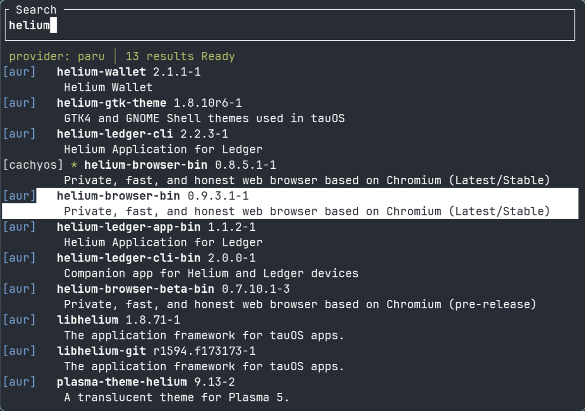

# fex

A universal interactive package search TUI.



## Supported Providers

- **apk** - Alpine Linux
- **apt** - Debian/Ubuntu
- **brew** - Homebrew (macOS/Linux)
- **dnf** - Fedora/RHEL
- **flatpak** - Flatpak (cross-distro, searches Flathub and other remotes)
- **nix** - Nix/NixOS
- **pacman** - Arch Linux (official repos)
- **paru** - Arch AUR helper (official repos + AUR)
- **snap** - Snap (cross-distro, searches the Snap Store)
- **xbps** - Void Linux
- **yay** - Arch AUR helper (official repos + AUR)
- **zerobrew** - Zerobrew (Homebrew drop-in)
- **zypper** - openSUSE

> On some systems the first search may be slow if the package manager cache needs updating.

## Installation

Install `rust` following official instructions [here](https://rust-lang.org/tools/install/).

Then simply run:

```bash
cargo install fex
```

## Building

With `cargo`:

```bash
cargo build --release
```

The binary ends up at `target/release/fex`.

## Usage

```bash
fex                 # Auto-detect best available provider
fex -p pacman       # Use a specific provider
fex -l              # List available providers
fex -h              # Show help
fex -V              # Show version
```

## Controls

| Key | Action |
|-----|--------|
| Type | Search for packages |
| Up / Down | Navigate results |
| PgUp / PgDn | Navigate by page |
| Home / End | Jump to first / last result |
| Enter | Install selected package |
| Escape | Clear search |
| Ctrl+X | Quit |

## Testing with Docker

Install Docker (example for Arch):

```bash
sudo pacman -S docker
sudo systemctl enable --now docker
sudo usermod -aG docker $USER
newgrp docker  # or logout/login
```

Then run a distro container with `fex` already built:

```bash
./testing/test.sh alpine    # Alpine (apk)
./testing/test.sh arch      # Arch Linux (pacman, yay)
./testing/test.sh fedora    # Fedora (dnf)
./testing/test.sh flatpak   # Flatpak with Flathub
./testing/test.sh homebrew  # Linuxbrew (brew)
./testing/test.sh nixos     # NixOS (nix)
./testing/test.sh opensuse  # openSUSE (zypper)
./testing/test.sh snap      # Snap Store (requires privileged — handled automatically)
./testing/test.sh ubuntu    # Ubuntu (apt)
./testing/test.sh void      # Void Linux (xbps)
./testing/test.sh zerobrew  # Zerobrew (brew symlink)
```

Podman works as a drop-in replacement — the script detects it automatically.

## Adding a New Provider

1. Create `src/providers/yourprovider.rs` and implement the `Provider` trait:
   - `name()` — provider name string
   - `is_available()` — check if the tool exists (`command_exists("tool")`)
   - `search(query)` — run the search command and return a `SearchResult`
   - `install_command(pkg)` — return the install command string
   - Optionally override `source_color(source)` for colored source badges
2. Declare the module in `src/providers/mod.rs` and add it to `create_provider()`, `auto_detect_provider()`, and `get_available_providers()`

## Inspiration

Based on my prior work on the C++26 version of this [paclook](https://github.com/krisfur/paclook).
